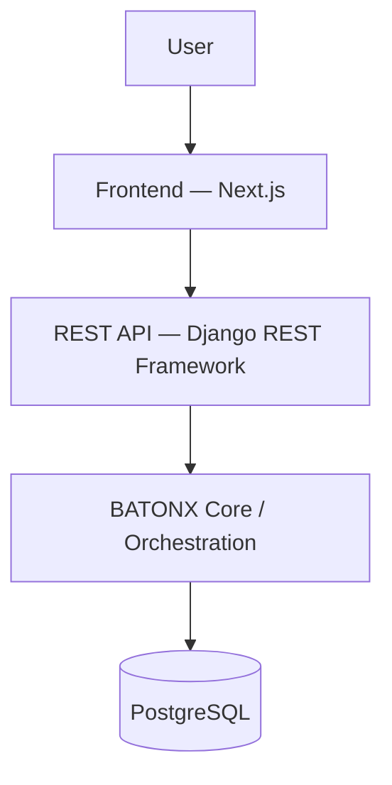
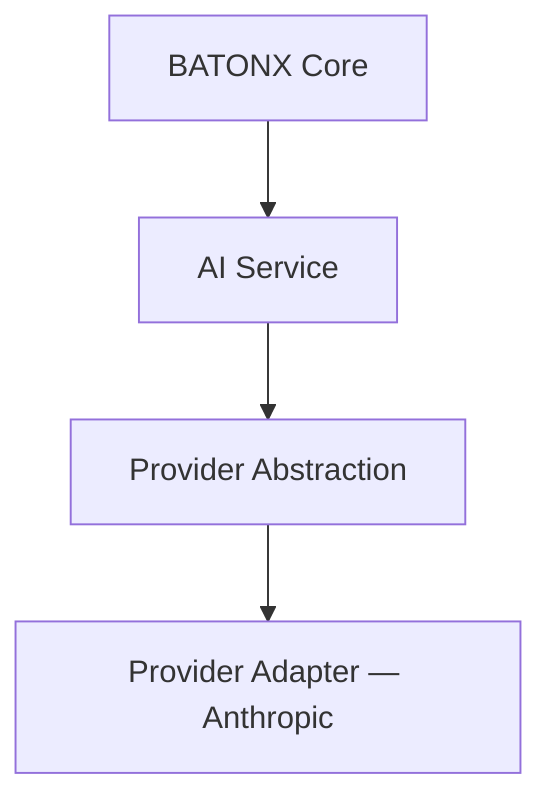

# BATONX

**AI Development & Data Orchestration Platform**

> You lead. BATONX orchestrates. AI executes.

---

## Overview

BATONX is an orchestration and project-intelligence layer that sits **above** coding and data agents — not a replacement for them. It turns a raw idea or a business question into a structured, traceable project: real requirements, a real architecture, a real plan, real progress tracking, and a real delivery-readiness check — all before (and while) an execution agent like Claude Code, Codex, or Cursor does the actual building.

It is built for engineers and technical teams who already use AI coding/data tools effectively, but keep losing the *project* in the process — the decisions, the "why," the dependencies, the state of what's actually approved versus what's still a draft. BATONX is that missing layer: it structures the work, keeps a durable memory of every decision, and hands the execution layer exactly the context it needs, when it needs it.

BATONX does not write code, run pipelines, or deploy anything itself. It orchestrates the project; your agent of choice executes.

## Core Principle

**AI proposes → Human decides → System remembers.**

Every artifact BATONX generates — a Blueprint, an Architecture, a Metric definition — is a draft until a human approves it. Nothing is ever applied silently. Every approval, edit, and rejection becomes permanent, traceable project context that the next step (human or AI) can rely on.

## Why BATONX?

AI coding and data tools have gotten very good at *execution*. What they don't do is hold a project together:

- structured requirements that don't drift
- an architecture with a stated rationale
- explicit dependencies between decisions
- a place for approvals to actually mean something
- context that survives longer than one chat session
- visible progress and a real delivery-readiness check
- a review step before something becomes authoritative

BATONX orchestrates that layer, so the execution agent underneath always receives current, approved, project-specific context — never a stale prompt improvised from memory.

## Product Architecture





The deterministic layer (progress computation, stale-dependency propagation, readiness checks, ownership/authorization) never depends on an AI call succeeding. AI is only ever invoked to *draft* something a human then reviews — the provider abstraction shown above is what keeps that generation step swappable rather than hardwired to one vendor. See [`docs/ARCHITECTURE.md`](docs/ARCHITECTURE.md) and [`docs/AI_ARCHITECTURE.md`](docs/AI_ARCHITECTURE.md) for the full picture.

## Software Journey

| Stage | What happens |
|---|---|
| **Discovery** | Answer a few questions that shape everything after. |
| **Blueprint** | The product definition — scope, roles, requirements. |
| **Business Logic** | Explicit rules, permissions, and state transitions. |
| **Architecture** | The technical design an execution agent will build against. |
| **Roadmap** | Tasks, dependencies, and the plan you approve. |
| **Tasks / Build** | Executing tasks — each with a generated Build Prompt. |
| **Review** | Tasks awaiting your review, each with a generated Review Prompt. |
| **Progress** | What's done, in review, or blocked, right now. |
| **Delivery Readiness** | Automatic checks plus your own manual confirmations. |

## Data Journey

| Stage | What happens |
|---|---|
| **Brief** | The business question and the goal an analysis serves. |
| **Sources** | Register and profile the raw datasets in play. |
| **Quality** | Observed data-quality checks and how they were resolved. |
| **Transformation** | The plan for turning raw sources into governed data. |
| **Metrics** | Defined, approved metrics/KPIs with a stated business meaning. |
| **Queries** | Approved query plans and their real, executed results. |
| **Analysis** | Findings and AI-proposed interpretations, kept clearly separate. |
| **Progress** | What's validated, pending, or blocked, right now. |
| **Delivery** | A dashboard blueprint and build prompt, readiness-checked. |

BATONX keeps three things deliberately separate at every step of the Data Journey:

- **Observed Facts** — what the data actually shows, deterministic, never guessed.
- **AI Interpretation** — what an observation might mean, always labeled as a proposal.
- **Human Decisions** — what you approved — the only thing execution ever acts on.

## BATONX Intelligence

BATONX Intelligence is a project-aware panel, not a generic chatbot bolted onto the side. It's always aware of:

- the current stage of the project
- which artifacts are approved
- which dependencies are stale
- real progress, computed deterministically
- delivery readiness

It can answer questions using that real project state, or propose a specific, scoped change — but it never applies a change itself. Every proposal still goes through the same human approval step as anything else in the product.

## Human-in-the-Loop

- **Draft** — every generated artifact starts as a draft.
- **Approval** — a human reviews and approves before it becomes authoritative.
- **Proposal** — a scoped, structured suggested change to something already approved.
- **Approve / Reject** — the only two ways a proposal is resolved; nothing applies on its own.
- **Stale propagation** — approving an upstream change marks real, specific downstream artifacts for re-review — never a silent, invisible drift.

## Security & Ownership

- Django session-based authentication (not a bare token in local storage).
- CSRF protection enforced on every unsafe request.
- Every project has a real owner; every nested resource (tasks, datasets, metrics, proposals, …) is scoped to its parent project, so there is a single authorization chokepoint rather than one check per resource type.
- Accessing a project you don't own returns a plain "not found" — it never discloses that the project exists under someone else's account.

This describes the implemented authorization model, not a security certification or a production hardening audit. See [`docs/SECURITY.md`](docs/SECURITY.md) for details and current caveats.

## Tech Stack

**Frontend** — Next.js (App Router), TypeScript, Tailwind CSS, React Query, Framer Motion (Landing only)
**Backend** — Python, Django, Django REST Framework
**Database** — PostgreSQL
**AI Architecture** — a provider-agnostic operation runner with one adapter currently wired (Anthropic); see [`docs/AI_ARCHITECTURE.md`](docs/AI_ARCHITECTURE.md)
**Testing** — Django's test runner (563 automated backend tests); TypeScript + ESLint + production build on the frontend

## Testing

**563 automated backend tests**, covering:

- the Software workflow (Discovery through Delivery Readiness)
- the Data workflow (Brief through Delivery)
- authentication, project ownership, and cross-user isolation
- proposal creation, approval, rejection, and application
- stale-dependency propagation across both workflows
- progress and delivery-readiness computation
- regression protection as the product grew across many phases

This is regression coverage for a real, evolving product — not a claim of zero bugs. The frontend is validated with TypeScript, ESLint, and a production build rather than an automated frontend test suite (see [`docs/TESTING.md`](docs/TESTING.md) for the honest current scope).

## AI-Assisted Engineering Approach

BATONX was developed using a structured, AI-assisted software engineering workflow. Requirements, product decisions, system design, software architecture, domain modeling, workflow design, API design, security decisions, prompt/instruction design, code review, debugging, integration, and testing were all human-directed. Coding agents were used to accelerate implementation against that direction, not to design the product autonomously.

The same principle the product embodies also describes how it was built: a human leads, an orchestration process structures the work, and an AI agent executes against clear direction. See [`docs/DEVELOPMENT_APPROACH.md`](docs/DEVELOPMENT_APPROACH.md) for the full workflow.

## Local Development

**Prerequisites:** Python 3.11+, Node.js 18+, PostgreSQL running locally.

**Backend**

```bash
cd backend
python -m venv .venv
source .venv/bin/activate
pip install -r requirements.txt
cp .env.example .env
python manage.py migrate
python manage.py runserver localhost:8000
```

**Frontend**

```bash
cd frontend
npm install
cp .env.local.example .env.local
npm run dev -- -p 3010 -H localhost
```

Then open **http://localhost:3010**.

See [`docs/LOCAL_SETUP.md`](docs/LOCAL_SETUP.md) for the full setup, including required environment variables and a Next.js dev/build caveat discovered during this project.

## Current Status

BATONX currently runs **locally only**. There is no production deployment. Deterministic features (workflows, progress, readiness, ownership, proposals) work fully offline; anything that generates new content with AI requires a real provider API key configured in `backend/.env` — without one, those steps show an honest "AI isn't configured" state rather than failing silently.

## Current Limitations

These are current scope boundaries, not defects — all considered future work:

- No production deployment yet
- No billing or subscription system
- No organization/team accounts — single-user ownership only
- No autonomous code execution — BATONX orchestrates; it never writes or runs code itself
- No production multi-provider AI router — one provider adapter is wired today, behind a provider-agnostic interface
- No live data-warehouse connectors — the Data workflow currently profiles/queries uploaded sources locally
- No external deployment automation

## Roadmap

Future areas under consideration (not committed, not scheduled):

- Additional AI provider adapters and routing
- Production infrastructure and deployment
- Teams / organizations
- Billing
- Deeper execution-agent integrations
- Additional data engineering capabilities (live connectors, larger-scale processing)

## Screenshots

_Screenshots are not yet included in this repository._ See [`docs/screenshots/README.md`](docs/screenshots/README.md) for the planned set and what each should show.

## Repository Structure

```
backend/    Django project — REST API, orchestration core, AI provider abstraction
frontend/   Next.js application — Software/Data Workspace, BATONX Intelligence, Landing
docs/       Engineering documentation (architecture, journeys, security, testing, setup)
```

See [`docs/ARCHITECTURE.md`](docs/ARCHITECTURE.md) for what lives inside `backend/` and `frontend/`.

## Author

**Anas Alharbi**
Software Engineer

---

©️ 2026 Anas Alharbi. All rights reserved.
