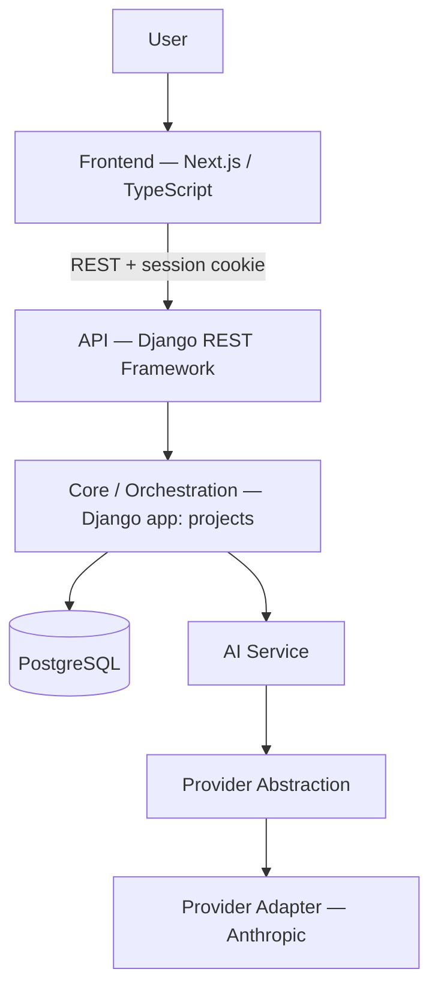

# Architecture

## Layers



**Frontend** — Next.js App Router, TypeScript, Tailwind CSS. Fully client-fetched: pages call the REST API directly via a thin typed client (`frontend/src/lib/api`) rather than server-side data fetching, keeping the frontend a pure presentation layer over the same API any other client would use.

**API** — Django REST Framework views under `backend/api` and `backend/projects`. Session-based authentication (`common/auth.py`) plus Django's built-in CSRF protection. Every request that touches a project resolves through one ownership chokepoint (`_project_or_404`) rather than a separate check per resource type.

**Core / Orchestration** — the `projects` Django app. This is where the product's actual rules live: the Software and Data stage machines, dependency/stale-propagation logic (`dependencies.py`), progress and delivery-readiness computation (`progress.py`, `ship_checklist.py`), the Roadmap/task lifecycle (`roadmap.py`), and Proposal creation/application (`*_services.py`). All of this is deterministic Python — no AI call sits on the path that decides ownership, progress, or whether something is stale.

**AI Service** — the `ai` Django app. A provider-agnostic operation runner (`ai/base.py`) that only speaks a small `Provider` protocol (`ai/providers/base.py`): build a prompt, ask the resolved provider for structured output, validate it against a Pydantic schema, allow one self-correction retry on validation failure, and return a typed result. One concrete adapter is currently wired (`ai/providers/anthropic.py`). Every attempt is logged (`AIRequestLog`) for cost/latency visibility. See [`AI_ARCHITECTURE.md`](AI_ARCHITECTURE.md).

**Database** — PostgreSQL. Standard Django migrations under each app's `migrations/` directory.

## Why deterministic and AI-driven logic are kept apart

Two very different reliability requirements are in play. Ownership, progress, staleness, and readiness must be correct every single time and must never depend on a network call to a third party succeeding — so they're pure Python functions over the database. Generating a first draft of a Blueprint or an Architecture benefits from an LLM, but that generation step is explicitly a *proposal*: it produces a draft a human reviews, never a fact the system trusts on its own. Keeping these two kinds of logic in separate apps (`projects` vs. `ai`) makes that boundary a structural fact of the codebase, not just a convention.

## Why the provider abstraction exists

`ai/base.py` never imports an SDK directly — it depends only on the `Provider` protocol. That means swapping or adding a model provider is a matter of writing one more adapter behind that protocol, not touching the operation runner, the prompt templates, or any caller in `projects`. Today exactly one adapter exists (Anthropic); the seam is real and already load-bearing (every AI-backed generation in the product goes through it), but multi-provider routing itself is not built — see [`AI_ARCHITECTURE.md`](AI_ARCHITECTURE.md) for the current/future split.

## Project-based domain

Nearly everything in the product hangs off a single `Project` row: it carries the project type (software/data), the current stage, every artifact's content and approval timestamp, and the `downstream_stale` map used for stale-propagation. Child resources (tasks, datasets, metrics, queries, proposals, conversations) are always looked up scoped to their parent project (`Model.objects.get(id=x, project=project)`), which is what lets a single ownership check at the project level secure the entire object graph underneath it — no child model needs its own `owner` field.

## Repository layout

```
backend/
  api/          Cross-cutting API views (health, auth)
  common/       Shared auth/session plumbing
  config/       Django settings, URL root
  projects/     Core domain: Software + Data orchestration, proposals, progress
    data/       Data-workflow-specific services and models
  ai/           Provider-agnostic AI operation runner, providers, prompts
  tests/        Backend test suite (563 tests)

frontend/
  src/app/          Next.js routes (Landing, auth, Projects, Workspace stage pages)
  src/components/   UI components, organized by domain (blueprint, roadmap, data, shell, ...)
  src/lib/          API client, journey/status model, i18n, design tokens
```
